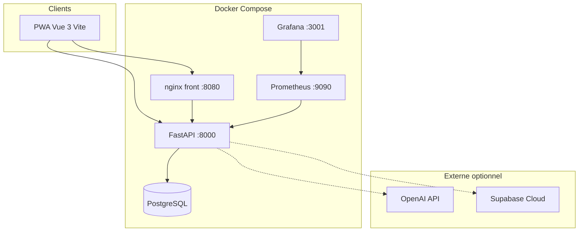
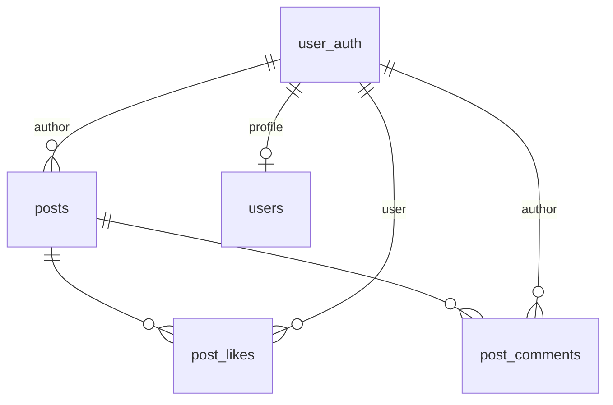

# Architecture système — MSPR3

## Vue d'ensemble



## Composants

| Composant | Technologie | Responsabilité |
|-----------|-------------|----------------|
| PWA | Vue 3, Pinia, Tailwind | UI coaching + feed social |
| API | FastAPI, SQLAlchemy 2 | REST, JWT, upload médias |
| BDD | PostgreSQL 16 | Persistance |
| IA | OpenAI GPT-4o / mini | Coach (mock offline possible) |
| ETL | pandas, GitHub Actions | Jeux de données Kaggle |
| Monitoring | Prometheus + Grafana | Métriques HTTP |

## Modèle de données — social



Tables clés : `user_auth`, `posts`, `post_likes`, `post_comments` (migration `007`).

## Déploiement

- **Démo locale** : Docker Compose profils `full` / `offline` / `performance`
- **Développement** : Supabase + uvicorn + `npm run dev`
- **CI** : pytest + build + build images

## Schéma réseau (démo)

```
Navigateur → :8080 (nginx) → fichiers statiques PWA
Navigateur → :8000 (API) → PostgreSQL :5432
Prometheus → :8000/metrics
```

## Sécurité

- Authentification JWT (bcrypt, HS256)
- CORS configurable
- Upload médias : types MIME whitelist, 50 Mo max
- RGPD : `DELETE /auth/me` cascade

Voir aussi [`modele-donnees.md`](modele-donnees.md) et [`deploiement.md`](deploiement.md).
